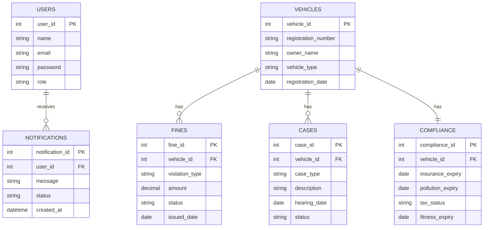
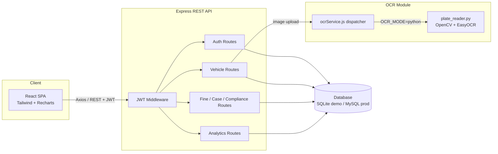
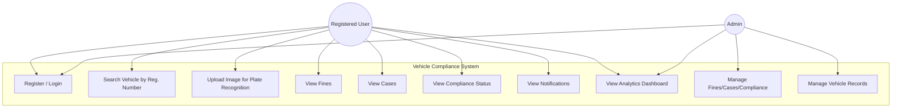
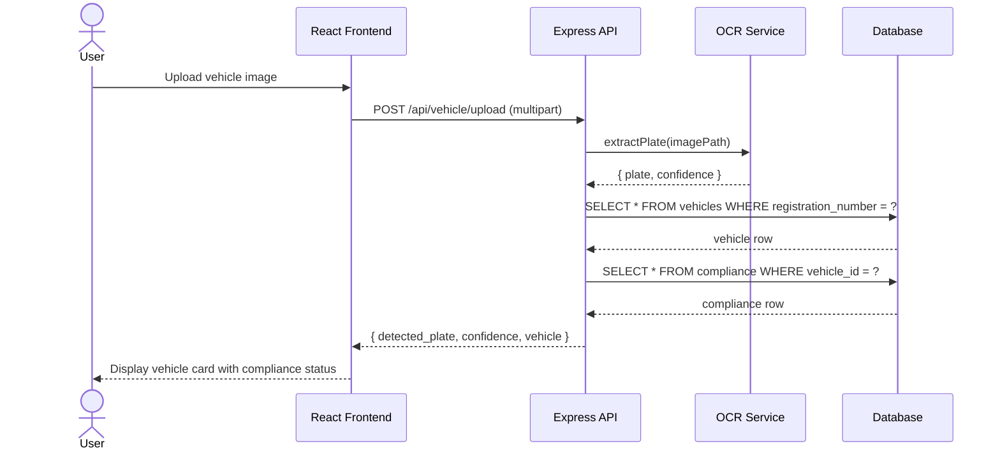

# System Diagrams

Rendered with Mermaid — view in any Mermaid-compatible viewer (GitHub, VS Code
extension, mermaid.live) or paste into the Mermaid Live Editor.

## 1. Entity-Relationship Diagram

## 2. System Architecture Diagram

## 3. Use Case Diagram

## 4. Sequence Diagram — Image-Based Vehicle Search

